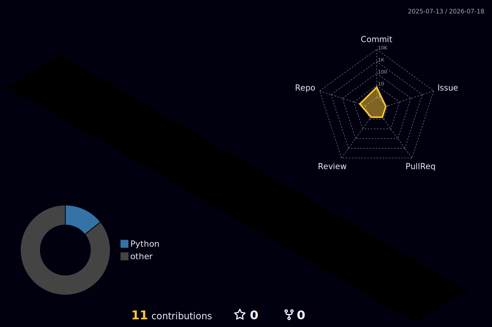

# SYED MOIN RAZA BUKHARI

<div align="center">


</div>

## Who I Am

```ts
const syedMoin = {
  name: "SYED MOIN RAZA BUKHARI",
  role: "BS Computer Science Student",
  focus: ["Data Science", "Machine Learning"],
  careerDirection: "AI Engineering",
  languages: ["Python"],
  dataScience: ["NumPy", "Pandas", "Matplotlib"],
  machineLearning: ["Scikit-learn", "TensorFlow"],
  database: ["MySQL", "SQL"],
  status: "Building and learning through practical projects"
};
```

## Tech Stack

<div align="center">


<br><br>


</div>

## Currently Learning

<div align="center">


</div>

## Featured Projects

I am currently organizing and publishing my projects on GitHub. Featured projects will appear here as the repositories are published.

## GitHub Stats

<div align="center">


<br>


</div>

## GitHub Trophies

<div align="center">


</div>

## Contribution Activity


 3D Contribution Graph
<div align="center">

</div>
-->

## Certifications

<div align="center">


</div>

## Connect With Me

<div align="center">

<a href="https://github.com/smoinx">

</a>

</div>


