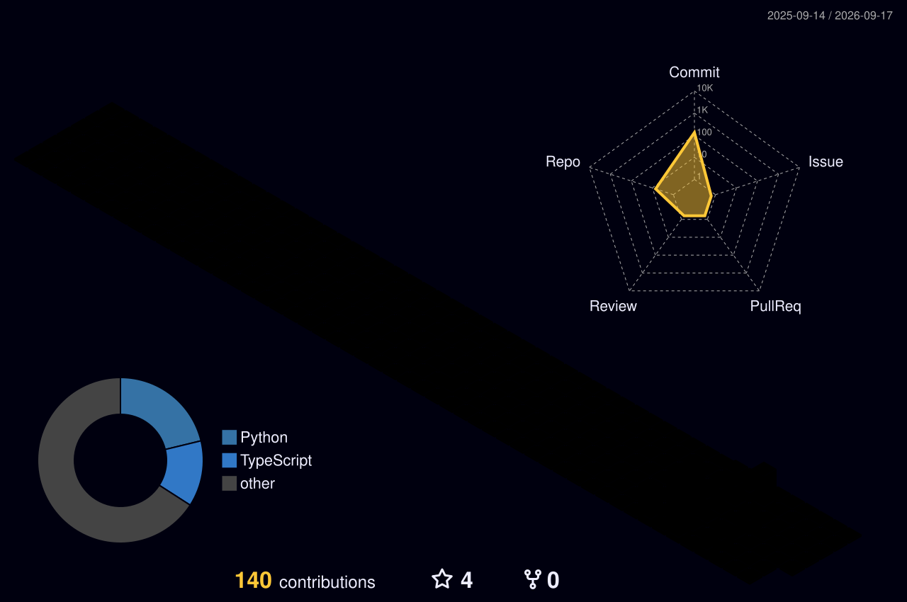

<picture>
  <source
    media="(prefers-color-scheme: dark)"
    srcset="https://raw.githubusercontent.com/smoinx/smoinx/main/dark.svg">

  <source
    media="(prefers-color-scheme: light)"
    srcset="https://raw.githubusercontent.com/smoinx/smoinx/main/light.svg">

  
</picture>

<h1 align="center">Hi 👋, I'm Syed Moin Raza Bukhari</h1>

  

  

  

  

  

---

# 🚀 About Me

🎓 BS Computer Science Student

🤖 Passionate about Artificial Intelligence & Machine Learning

📊 Currently learning Data Science & Deep Learning

🌱 Exploring LLMs, RAG, AI Agents & TensorFlow

💡 Building AI-powered real-world applications

🎯 Goal: Become an AI Engineer

---

# 🛠 Tech Stack

### Languages

### Frontend

### Backend

### Database

### AI / Data Science

NumPy • Pandas • Matplotlib • Scikit-learn • Machine Learning

### Tools

---

# 📈 GitHub Analytics

  
  

  

  

# 📊 Contribution Graph

---

# ⭐ Featured Projects

## 🚀 SIFT

AI-powered project built for Hackathon.

**Tech**

React • TypeScript • Tailwind • AI

---

## 🌾 Smart Agriculture Monitoring System

Database-driven agriculture management system.

**Tech**

Python • Streamlit • PostgreSQL

---

## 🥊 Online Tekken Tournament System

Full-stack tournament management platform.

**Tech**

React • Express • MySQL

---

## 🤖 Rock Paper Scissors AI

Machine Learning strategy bot that predicts opponent moves.

**Tech**

Python • Machine Learning

---

# 🏆 Achievements

🥉 Bronze Medal — CALICO (UC Berkeley)

🏅 MIT Informatics Tournament — Global Ranking

🏅 Meta Hacker Cup Participant

📜 IBM SkillsBuild Certificates

📜 AWS Educate

📜 Kaggle Certificates

---

# 📚 Currently Learning

- Machine Learning
- Scikit-learn
- TensorFlow
- Deep Learning
- Large Language Models
- Retrieval-Augmented Generation (RAG)
- AI Agents

---

# 📫 Connect With Me

---

⭐ Thanks for visiting my profile!

If you like my work, consider starring my repositories.

