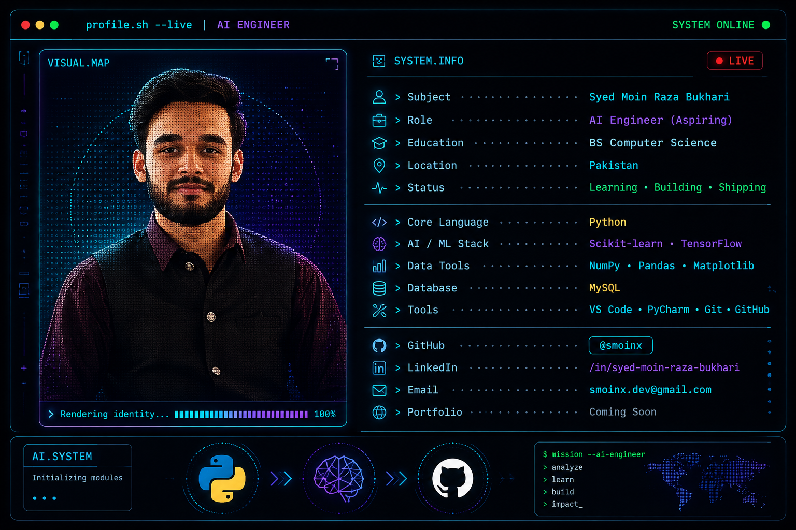

  

# Hi, I'm Syed Moin Raza Bukhari 👋

### Computer Science Student • Building AI Solutions

Passionate about **Artificial Intelligence, Machine Learning, and Data Science**.

Currently focused on building practical AI applications while strengthening my software engineering skills.

---

# 👨‍💻 About Me

- 🎓 BS Computer Science Student
- 🤖 Aspiring AI Engineer
- 🐍 Python Developer
- 📊 Interested in Machine Learning & Data Science
- 🌱 Currently learning Scikit-learn, TensorFlow, and Deep Learning
- 🚀 Building projects that solve real-world problems

---

# 🛠 Tech Stack

### Languages

### Data Science

### Databases

### Tools

---
# 📊 GitHub Analytics

# 🚀 Featured Projects

## 🎮 Online Tekken Tournament Management System

Database-driven tournament platform featuring:

- Player registration
- Match scheduling
- Tournament brackets
- Leaderboards
- MySQL backend

---

## 🤖 Rock Paper Scissors AI

Machine Learning project built for the freeCodeCamp Machine Learning Certification.

Features:

- Adaptive prediction
- Pattern recognition
- AI decision making

---

## 🌱 Smart Agriculture Monitoring System

Agriculture monitoring dashboard built using Streamlit.

Features:

- Weather monitoring
- Soil data
- Crop management
- Farmer management

---

# 📜 Certifications

- IBM SkillsBuild — Artificial Intelligence Fundamentals
- IBM Cognitive Class — Data Analysis with Python
- freeCodeCamp — Machine Learning with Python

---

# 🌱 Currently Learning

- Machine Learning
- Deep Learning
- TensorFlow
- AI Engineering
- LLMs
- AI Agents

---

# 🎯 2026 Goals

- Build high-quality AI projects
- Master Machine Learning
- Learn Deep Learning
- Explore LLMs & RAG
- Contribute to Open Source
- Secure an AI Internship

---

# 📫 Connect

- GitHub: https://github.com/smoinx
- LinkedIn: *(Add your LinkedIn URL)*
- Email: *(Add your email)*

---

### Thanks for visiting my profile!

*"Building intelligent systems, one project at a time."*

